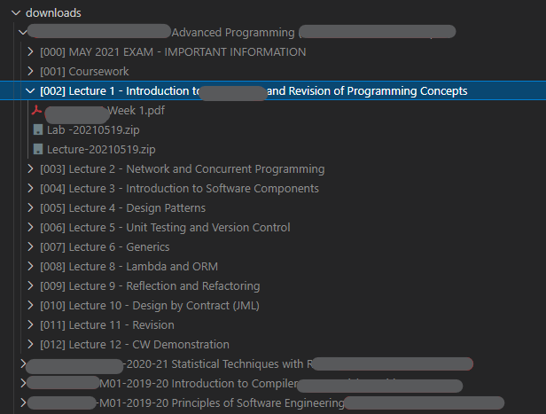

# Moodle resource downloader

## About
Web scrapper built with [Puppeteer](https://developers.google.com/web/tools/puppeteer/) and Typescript, with its focus being downloading moodle resources. Additionally it organises them for each module and section/week.

## Why?
I made this because I needed to download a lot of resources and automating the process seemed a fun way to learn about web scraping.

## DISCLOSURE
This scrapper was developed based on the interface of a education institution that I'm part of. So it might not work on yours.

## Pre-Requisites
Before installing the scrapper, you will need the following:

You will need to have Node.js installed. A version of grater or equal to `v12.x`.
You can download here: [https://nodejs.org/en/](https://nodejs.org/en/)
## Installation

- Install the dependencies: `npm install`
- Build the project: `npx tsc`

## Run configuration
You can run the scrapper by simply using `npm run start` or `node ./dist/main.js`.

There are some run configurations you can set up. Either via command line and/or configuration file (`scrapper-config.json`).

There is no `scrapper-config.json` because private information might be present there, so create one based on the file: `template-scrapper-config.json`.

### Config
If there there is a option that is present in both command line and configuration file, the CLI flag and JSON parameter will be seperated by a `|`.

- `--username <moodle-login-username>` | `username` The username you use to login
- `--download-path <path>` | `downloadPath` The path where the resources will be downloaded(By default it's the `./downloads` folder located in the root of the project)
- `--no-headless` When this flag is on, Puppeteer will be executed with the option with the headless mode deactivated. Headless mode allows the scrapper to run without displaying the UI. 
- `--wait-page-after-login | waitPageAfterLogin` - What page should the scrapper wait after authenticating.
- `--auth-method` | `authMethod` - It can have one of the following values: `"user-control"`, `"terminal-user-passw"`. Default `terminal-user-passw`

- - `user-control` allows you to insert your username and password in the browser's page like an usual login procedure.
It's useful if you don't want to input your credentials in the terminal.
Only disadvantage is that the UI will need to be displayed, which requires the headless mode to be disabled.
- - If you want to use `user-control`, it can also be run with the shortcut: `npm run start:auth-user-control`

- - `terminal-user-passw` The username and password will be prompted by the terminal. Doing this way allows the scrapper/puppeteer to run in headless mode(or not with the flag `--no-headless`)

- - I prefer using `terminal-user-passw` because the UI does not provide much information, it will be mostly noise. But it's useful to see the actions of the script and if the user prefers to input credentials in the UI instead of the terminal.
